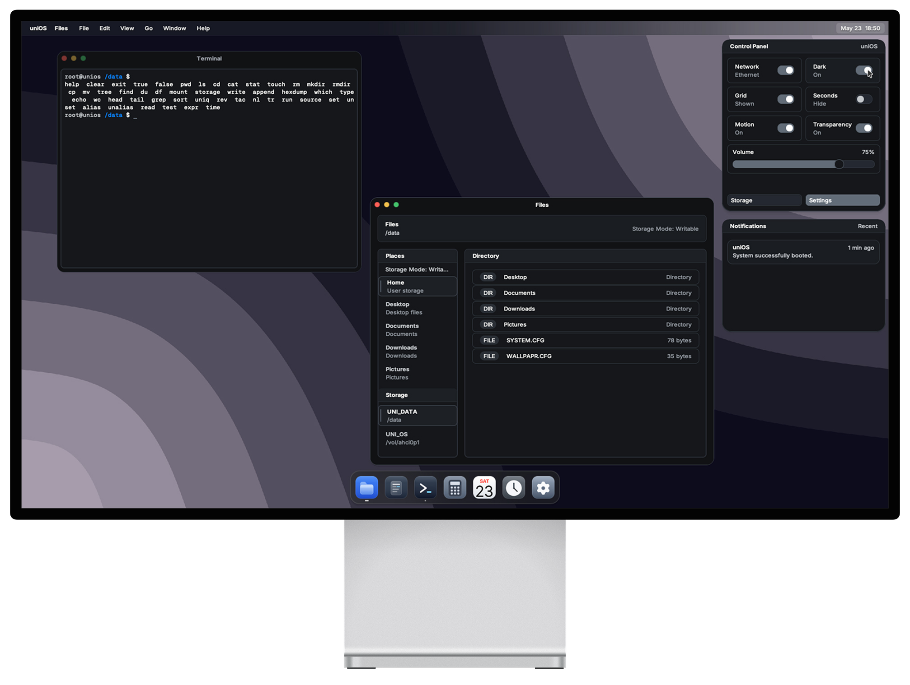

# uniOS

`uniOS` is a custom x86-64 operating system written in freestanding C++20. It boots through the in-tree Meridian UEFI bootloader and starts a native desktop userspace session.

<picture>
  <source media="(prefers-color-scheme: dark)" srcset="docs/assets/site/screenshot_dark.png">
  <source media="(prefers-color-scheme: light)" srcset="docs/assets/site/screenshot_light.png">
  
</picture>

## Current System

- **Bootloader**: Meridian, an in-tree x86-64 UEFI loader.
- **Boot handoff**: Repo-owned `BootInfo` structure passed from Meridian to the kernel.
- **Build system**: Meson + LLVM using `toolchains/llvm.ini`.
- **Default boot image**: `boot.img`, a raw disk image with an EFI system partition and a writable `UNI_DATA` FAT32 partition.
- **Desktop session**: `/bin/init.elf` launches the window manager, menubar, dock, and userspace applications.
- **Userspace**: Native ELF programs under `src/usr/`, with libc wrappers, a GUI library, shell, terminal, and desktop apps.
- **Filesystems**: Boot content from `unifs.img`; persistent data from FAT32 mounted at `/data` when available.
- **Drivers and subsystems**: Paging, heap allocation, preemptive scheduling, syscalls, VFS, PCI, ACPI/APIC, PS/2 input, USB/xHCI, USB HID, USB mass storage, e1000, RTL8139, IPv4, TCP, UDP, DHCP, DNS, AC97, HDA, and framebuffer display output.

## Repository Layout

- `src/bootloader/`: Meridian UEFI bootloader.
- `src/kernel/`, `src/mm/`, `src/fs/`, `src/net/`, `src/drivers/`: Kernel and subsystem code.
- `src/usr/`: Userspace runtime, libc subset, GUI library, shell, window manager, desktop services, and apps.
- `include/`: Kernel, driver, boot, and UAPI headers.
- `rootfs/`: Authored runtime files and config templates staged into `unifs.img`.
- `appicons/`, `assets/`, `cursors/`: Source assets used by the asset tools.
- `docs/`: Project site.
- `docs/reference/`: Architecture, shell scripting, and asset format notes.
- `tools/`: Image, filesystem, rootfs staging, asset conversion, and QEMU helper scripts.
- `toolchains/`: Meson cross-file configuration.

## Runtime Asset Formats

uniOS uses generated binary asset formats in the runtime image:

- `.uoic`: Icon packages.
- `.uocu`: Cursor packages.
- `.uof`: Font files.
- `.uowp`: Wallpaper packages.

The default wallpaper package is generated from `assets/wallpapers/wp_light.svg` and `assets/wallpapers/wp_dark.svg`, staged as `/usr/share/wallpapers/default.uowp`.

## Build Requirements

- `meson` and `ninja`
- `clang`, `clang++`, `ld.lld`, `llvm-ar`, and `llvm-strip`
- `nasm`
- `qemu-system-x86_64` and OVMF UEFI firmware
- `python3` with `Pillow` and `CairoSVG` packages

### Configure and Build

**Release image:**
```bash
meson setup build/release --cross-file toolchains/llvm.ini --buildtype release
meson compile -C build/release boot-disk iso
```

**Debug image:**
```bash
meson setup build/debug --cross-file toolchains/llvm.ini --buildtype debug
meson compile -C build/debug boot-disk iso
meson test -C build/debug --suite smoke --print-errorlogs
```

### Common Run Targets

```bash
meson compile -C build/release run          # Standard QEMU run
meson compile -C build/release run-serial   # Run with serial console
meson compile -C build/release run-headless # Run without VGA output
meson compile -C build/release run-usb      # Run with USB storage emulation
meson compile -C build/release run-qemu-net # Run with network bridge
meson compile -C build/release run-qemu-full # Run with all features
```

### Developer Checks

```bash
meson compile -C build/debug lint
meson compile -C build/debug analyze
```

## Boot Images

The build system generates two primary boot targets:

- **`boot.img`**: A raw disk image with an EFI system partition and a pre-allocated, writable `UNI_DATA` FAT32 partition. This is the recommended image for most users.
- **`uniOS.iso`**: A UEFI-bootable ISO9660 image intended for CD/DVD or VM ISO boot testing.

Both images use the same Meridian loader and kernel. While the ISO media itself is read-only, uniOS will automatically discover and mount any accessible `UNI_DATA` partition for persistent storage.

For real hardware, write `boot.img` to a USB drive as a raw disk image.

## Runtime Paths

- **System settings**: `/data/SYSTEM.CFG` (fallback: `/etc/system.conf`)
- **Wallpaper settings**: `/data/WALLPAPR.CFG` (fallback: `/etc/wallpaper.conf`)
- **Default wallpaper**: `/usr/share/wallpapers/default.uowp`
- **Persistent data**: Mounted at `/data` from FAT32 volume `UNI_DATA`

## Documentation

- [Architecture](docs/reference/architecture.md)
- [Shell scripting](docs/reference/scripting.md)
- [Asset formats](docs/reference/formats/)

## License

MIT
