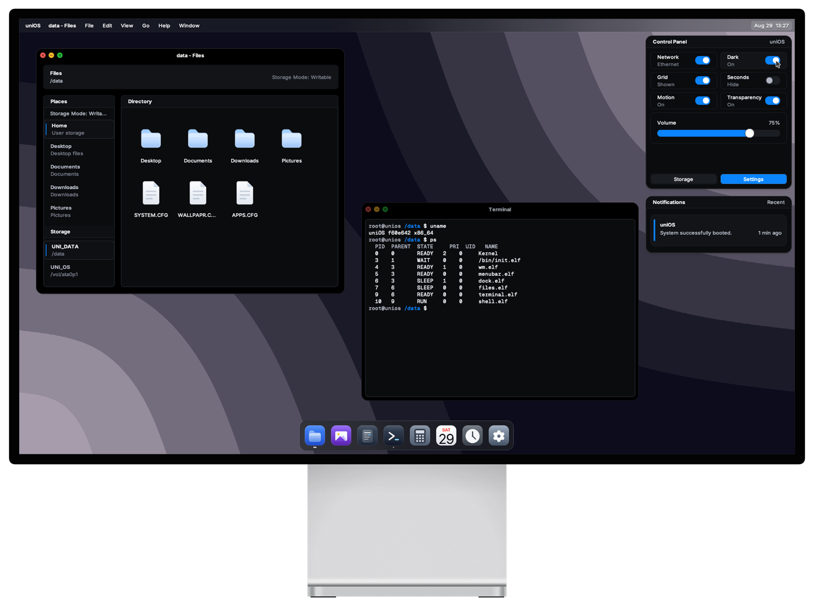

# uniOS

uniOS is a freestanding x86-64 operating system written in C++20. It boots through the in-tree Meridian UEFI bootloader and starts a native desktop userspace session.

<picture>
  <source media="(prefers-color-scheme: dark)" srcset="docs/assets/site/screenshot_dark.png">
  <source media="(prefers-color-scheme: light)" srcset="docs/assets/site/screenshot_light.png">
  
</picture>

## Contents

- [Overview](#overview)
- [Repository layout](#repository-layout)
- [Building](#building)
- [Running](#running)
- [Boot images](#boot-images)
- [Runtime](#runtime)
- [Documentation](#documentation)
- [License](#license)

## Overview

- **Boot**: Meridian, an in-tree UEFI loader, hands off a `BootInfo` structure to the kernel.
- **Kernel**: Paging, heap, preemptive SMP scheduling with per-core idle contexts, RESCHED IPIs, sequence-acknowledged TLB shootdowns, syscalls, and a VFS.
- **Userspace**: Native ELF programs under `src/usr/` — libc subset, GUI library, shell, terminal, and desktop apps launched by `/bin/init.elf`.
- **Filesystems**: Boot content from `unifs.img`; persistent data from a FAT32 `UNI_DATA` volume mounted at `/data`.
- **Drivers**: PCI, ACPI/APIC, PS/2, USB (xHCI, HID, mass storage), e1000, RTL8139, AC97, HDA, framebuffer display.
- **Network**: IPv4, UDP, TCP (windowed send with congestion control and RTT estimation), DHCP, DNS.

## Repository layout

| Path | Contents |
| --- | --- |
| `src/bootloader/` | Meridian UEFI bootloader |
| `src/kernel/`, `src/mm/`, `src/fs/`, `src/net/`, `src/drivers/` | Kernel and subsystems |
| `src/usr/` | Userspace: libc, GUI library, shell, window manager, desktop services, apps |
| `include/` | Kernel, driver, boot, and UAPI headers |
| `rootfs/` | Runtime files and config templates staged into `unifs.img` |
| `appicons/`, `assets/`, `cursors/` | Source assets consumed by the asset tools |
| `docs/reference/` | Documentation source (rendered to the wiki) |
| `tools/` | Image, filesystem, rootfs staging, asset, and QEMU helper scripts |
| `toolchains/` | Meson cross-file configuration |

## Building

Requirements:

- `meson`, `ninja`
- `clang`, `clang++`, `ld.lld`, `llvm-ar`, `llvm-strip`
- `nasm`
- `qemu-system-x86_64` with OVMF UEFI firmware
- `python3` with `Pillow` and `CairoSVG`

> [!IMPORTANT]
> The build is a Meson cross build and hard-errors without the LLVM cross file. Always pass `--cross-file toolchains/llvm.ini`.

```bash
meson setup build/release --cross-file toolchains/llvm.ini --buildtype release
meson compile -C build/release boot-disk iso
```

For a debug build (kernel tests and boot logs enabled), use `build/debug` with `--buildtype debug`, then run the smoke suite:

```bash
meson test -C build/debug --suite smoke --print-errorlogs
```

## Running

```bash
meson compile -C build/release run             # standard QEMU run
meson compile -C build/release run-serial      # with serial console
meson compile -C build/release run-headless    # without VGA output
meson compile -C build/release run-usb         # USB storage boot
meson compile -C build/release run-qemu-net    # with network devices
meson compile -C build/release run-qemu-full   # USB + network + serial
```

Developer checks:

```bash
meson compile -C build/debug lint      # cppcheck
meson compile -C build/debug analyze   # clang-tidy
```

## Boot images

- **`boot.img`** — raw disk image with an EFI system partition and a writable `UNI_DATA` FAT32 partition. Recommended for most uses.
- **`uniOS.iso`** — UEFI-bootable ISO9660 image for CD/DVD or VM ISO boot testing.

Both images use the same Meridian loader and kernel. The ISO media is read-only, but uniOS discovers and mounts any accessible `UNI_DATA` partition for persistent storage.

> [!CAUTION]
> Writing `boot.img` to a USB drive overwrites the entire drive. Double-check the target device before flashing.

## Runtime

Persistent state lives on the FAT32 `UNI_DATA` volume mounted at `/data`:

| Path | Purpose |
| --- | --- |
| `/data/SYSTEM.CFG` | System settings (fallback `/etc/system.conf`) |
| `/data/WALLPAPR.CFG` | Wallpaper settings (fallback `/etc/wallpaper.conf`) |
| `/usr/share/wallpapers/default.uowp` | Default wallpaper, generated from `assets/wallpapers/` |

Runtime assets use generated binary formats: `.uoic` (icons), `.uocu` (cursors), `.uof` (fonts), `.uowp` (wallpapers). See [Asset formats](docs/reference/formats/).

## Documentation

Full documentation lives at [unionyxx.github.io/uniOS/wiki](https://unionyxx.github.io/uniOS/wiki/), generated from `docs/reference/`.

> [!NOTE]
> Render the wiki locally with `meson compile -C build/debug wiki`.

- [Architecture](docs/reference/architecture.md)
- [SMP](docs/reference/smp.md)
- [Shell scripting](docs/reference/scripting.md)
- [Asset formats](docs/reference/formats/)

## License

MIT
