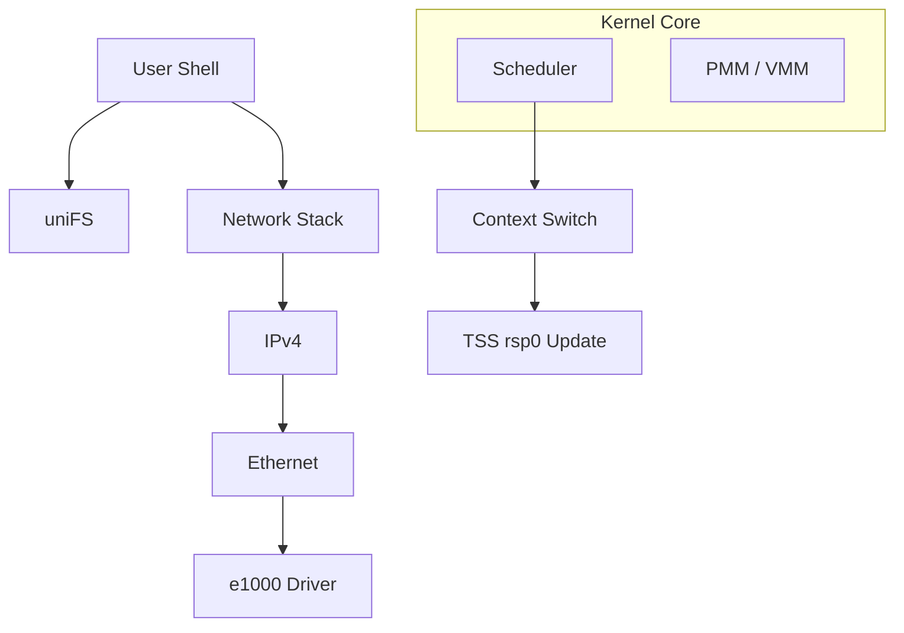

# uniOS Architecture

Technical overview for contributors and developers.

## Overview

**uniOS** is a scratch-built x86-64 operating system kernel written in C++20. It boots via **Limine** and provides a shell interface with networking, USB support, and a RAM-based filesystem.



## Memory Layout

| Virtual Address | Usage |
|-----------------|:------|
| `0x0000_0000_0000_0000` | User space (reserved, unused) |
| `0xFFFF_8000_0000_0000` | Higher Half Direct Map (HHDM) |
| `0xFFFF_FF80_0000_0000` | Fixed kernel stack per process |
| `0xFFFF_FFFF_9000_0000` | MMIO virtual base (`mmio_next_virt`) |

### Why These Addresses?

- **HHDM** is set by Limine. All physical memory is accessible at `phys + hhdm_offset`.
- **Kernel stack** is at a fixed virtual address so `fork()` doesn't corrupt RBP pointers. Each process has stacks at the same vaddr mapped to different physical pages.
- **MMIO** starts at a high address to avoid collisions with heap or HHDM.

## Memory Management

### PMM (Physical Memory Manager)

Bitmap-based allocator in `pmm.cpp`.

```cpp
#define BITMAP_SIZE 524288  // 512KB = covers 16GB RAM
```

> [!NOTE]
> Hardcoded bitmap size means RAM above 16GB is ignored. This prevents overflow but wastes memory on large systems.

### VMM (Virtual Memory Manager)

4-level paging (PML4 → PDPT → PD → PT).

Key functions:
- `vmm_map_page()` — Map in active PML4
- `vmm_map_page_in()` — Map in a passive PML4 (for `fork`)
- `vmm_clone_address_space()` — Deep copy user pages, share kernel pages
- `vmm_free_address_space()` — Free user pages on process exit

### Heap

Bucket allocator in `heap.cpp`. Fixed bucket sizes (32, 64, 128, ... bytes). Large allocations fall back to direct PMM pages.

Spinlock-protected for thread safety.

## Scheduler

Preemptive, timer-based at **1000Hz** (1ms granularity).

### Why 16KB Stacks?

```cpp
#define KERNEL_STACK_SIZE 16384
```

Deep call chains in networking (TCP → IP → ARP → driver → interrupt) can use 4-8KB. 16KB gives headroom. 4KB stacks caused overflows in practice.

### Context Switching

1. Save current task's callee-saved registers
2. Save FPU/SSE state via `fxsave`
3. Update `tss.rsp0` for next task
4. Switch CR3 if next task has different page table
5. Restore next task's state

### Process Isolation

`fork()` creates a new address space:
- Clones page tables (deep copy of user pages)
- Allocates separate physical stack pages
- Maps stack to same virtual address (`KERNEL_STACK_TOP`)
- Rebases RBP pointers when forking from HHDM-based kernel tasks

## Drivers

### Network (e1000)

Interrupt-driven RX, synchronous TX. Ring buffer descriptors. DHCP and DNS work reliably in QEMU. Real hardware support is best-effort.

### USB (xHCI)

Polling-based HID. Why not interrupts? xHCI interrupt handling requires async TRB processing which adds complexity. Polling at 1000Hz is good enough for keyboards.

<details>
<summary>xHCI Design Decisions</summary>

- **Scratchpad buffers**: Allocated at init for controller use
- **64-byte context stride**: Detected and handled dynamically
- **Legacy handoff**: BIOS may own the controller; we take ownership via USBLEGSUP

</details>

## uniFS

Flat filesystem with two file sources:

| Source | Storage | Writable |
|--------|---------|:--------:|
| Boot files | Limine module | No |
| RAM files | Kernel heap | Yes |

Files are stored as `{name, data, size}`. No directories. Suitable for config files and scripts, not large data.

## Build System

```bash
make          # Release (optimized, -O2)
make debug    # Debug (logs enabled, -O0 -g)
make run-gdb  # Attach GDB to localhost:1234
```

## Directory Structure

```text
kernel/
├── core/       # kmain, scheduler, debug, version
├── arch/       # GDT, IDT, interrupts, I/O
├── mem/        # PMM, VMM, heap
├── drivers/    # Hardware drivers
│   ├── net/    # e1000, RTL8139
│   └── usb/    # xHCI, HID
├── net/        # TCP/IP stack
├── fs/         # uniFS filesystem
└── shell/      # Command interpreter
```

## Coding Conventions

| Rule | Reason |
|------|--------|
| `-fno-exceptions` | Can't unwind stack in kernel |
| `-fno-rtti` | No `dynamic_cast` or `typeid` |
| `kstring::` not `std::` | Avoid libc dependencies |
| Named constants | Magic numbers are debugging nightmares |

## Key Files

| File | Purpose |
|------|---------|
| `kernel/core/kmain.cpp` | Kernel entry point |
| `kernel/core/scheduler.cpp` | Process management, context switch |
| `kernel/mem/vmm.cpp` | Page table manipulation |
| `kernel/net/tcp.cpp` | TCP state machine |
| `kernel/drivers/usb/xhci.cpp` | USB 3.0 driver |
